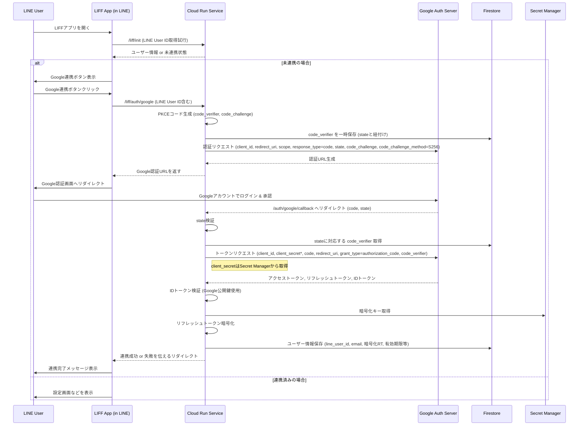

# システム設計書 (GCP版)

このドキュメントは、「カレンダーLINE連携要件定義書 (改訂版)」に基づき、GCP (Google Cloud Platform) 上でのシステムアーキテクチャと主要コンポーネントの設計を定義します。

## 1. システムアーキテクチャ概要

GCPのマネージドサービスを最大限に活用し、スケーラブルで信頼性が高く、運用管理しやすいシステムを目指します。

```mermaid
graph TD
    subgraph User Interaction
        User[LINE User] --> LINE_Platform[LINE Platform]
    end

    subgraph GCP Infrastructure
        LINE_Platform -- Webhook --> CloudRun[Cloud Run Service (FastAPI)]
        LINE_Platform -- LIFF Request --> CloudRun
        CloudRun -- CRUD Ops --> Firestore[Firestore (Database)]
        CloudRun -- Read/Write Secrets --> SecretManager[Secret Manager]
        CloudRun -- Process Text --> NLPEngine[Pattern-Based NLP Engine]
        NLPEngine -- Extract Info --> CloudRun
        CloudRun -- Schedule Task --> CloudTasks[Cloud Tasks]
        CloudScheduler[Cloud Scheduler] -- Trigger Task --> CloudTasks
        CloudTasks -- Execute Task --> CloudRun
        CloudRun -- Read/Write Events --> GoogleCalendar[Google Calendar API]
        CloudRun -- Log Events --> CloudLogging[Cloud Logging]
        CloudMonitoring[Cloud Monitoring] -- Monitor --> CloudRun
        CloudMonitoring -- Monitor --> Firestore
        CloudMonitoring -- Monitor --> CloudTasks
        GitHubActions[GitHub Actions (CI/CD)] -- Deploy --> CloudRun
        GitHubActions -- Push Image --> ArtifactRegistry[Artifact Registry]
    end

    subgraph External Services
        OpenAIAgents -- API Call --> OpenAI_API[OpenAI API]
        GoogleCalendar -- API Call --> Google_API[Google APIs]
    end

    User -- Use LIFF --> LIFFApp[LIFF Application (Hosted on Cloud Run or Static Hosting)]
    LIFFApp -- Auth Request --> CloudRun
    LIFFApp -- Get LINE Profile --> LINE_Platform
    LIFFApp -- Google Auth --> GoogleSignIn[Google Sign-In]
    GoogleSignIn -- Return Auth Code --> LIFFApp
```

**主要コンポーネント:**

-   **LINE Platform:** ユーザーからのメッセージ受信、LIFFの提供、プッシュメッセージ送信。
-   **Cloud Run Service (Backend):** Python (FastAPI) で実装されたメインアプリケーション。Webhook処理、LIFF関連API、カレンダー操作、AIエージェント連携、非同期タスク処理を担当。
-   **Firestore:** NoSQLデータベース。ユーザー情報、設定、トークン（暗号化）、リマインダー状態などを保存。
-   **Secret Manager:** APIキー、OAuthクライアントシークレット、DB接続情報、暗号化キーなどの機密情報を安全に保管。
-   **NLP Engine (初期リリース):** キーワード、正規表現、日時パターン (`datetime_patterns.py` 等) を用いて自然言語メッセージから意図と情報を抽出するコンポーネント。Cloud Runサービス内で実装。
-   **(リリース後) OpenAI Agents SDK:** より高度な自然言語処理、意図解釈、ツール実行を担当するコンポーネント。NLP Engineを置き換えるか、連携する形で導入。
-   **Cloud Tasks:** リマインダー通知送信などの非同期タスクをキューイングし、Cloud Runのエンドポイントを呼び出して実行。
-   **Cloud Scheduler:** 定期的なタスク（例: 毎朝の予定通知、トークン有効期限チェック）をトリガーし、Cloud Tasksにタスクを追加。
-   **Google Calendar API:** Googleカレンダーの予定の読み取り、作成、更新、削除を行う。
-   **LIFF Application:** LINEアプリ内で動作するWebアプリケーション（HTML/CSS/JS）。Google OAuth認証フローの実行、設定画面の提供。Cloud Run上で静的ファイルとしてホストするか、別途静的ホスティングサービスを利用。
-   **Artifact Registry:** アプリケーションのDockerイメージを保管。
-   **GitHub Actions:** ソースコードの変更をトリガーに、テスト、ビルド、Dockerイメージ作成、Cloud Runへのデプロイを自動化。
-   **Cloud Logging & Monitoring:** アプリケーションログ、パフォーマンスメトリクスを収集・監視し、アラートを設定。

## 2. コンポーネント設計 (概要)

### 2.1. Cloud Run Service (FastAPI Backend)

-   **役割:** アプリケーションの中核。APIエンドポイント提供、ビジネスロジック実行、外部サービス連携。
-   **主要エンドポイント:**
    -   `/webhook` (POST): LINE Messaging APIからのWebhook受信。署名検証後、メッセージ内容に応じて処理を振り分け。
    -   `/liff/auth/google` (GET): LIFFアプリからのGoogle OAuth開始リクエスト。Google認証URLへリダイレクト。
    -   `/auth/google/callback` (GET): GoogleからのOAuthコールバック。認証コードを受け取り、トークンを取得・保存。LIFFアプリへリダイレクト。
    -   `/liff/settings` (GET/POST): LIFFアプリからの設定取得・更新リクエスト。
    -   `/tasks/reminder` (POST): Cloud Tasksからのリマインダー実行リクエスト。
    -   `/tasks/token/refresh` (POST): Cloud Tasks/Schedulerからのトークン更新リクエスト。
    -   `/health` (GET): Cloud Runヘルスチェック用エンドポイント。
-   **内部モジュール構成 (例):**
    -   `main.py`: FastAPIアプリケーションインスタンス、ルーター設定。
    -   `routers/`: エンドポイントごとのルーター定義 (line_webhook.py, liff.py, tasks.py)。
    -   `services/`: ビジネスロジック (line_service.py, google_calendar_service.py, auth_service.py, reminder_service.py, nlp_service.py)。
    -   `repositories/`: Firestoreとのデータアクセス抽象化 (user_repository.py, reminder_repository.py)。
    -   `models/`: データモデル定義 (Pydanticモデル、Firestore用データクラス)。
    -   `nlp/`: 自然言語処理関連 (初期: datetime_patterns.py, intent_parser.py / リリース後: agents/ 以下に Agents SDK関連)
    -   `core/`: 設定読み込み、ロギング、エラーハンドリングなどの共通機能。
    -   `utils/`: 汎用的なヘルパー関数。

### 2.2. NLP Engine (初期リリース: パターン認識ベース)

-   **役割:** 自然言語メッセージを解析し、意図（予定追加、確認など）と情報（日時、タイトルなど）を抽出する。
-   **実行場所:** Cloud Runサービス内の `nlp_service.py` や `nlp/` ディレクトリ内のモジュールで実装。
-   **主要機能:**
    -   **意図分類:** キーワード（「追加」「教えて」「変更」「削除」など）や文脈からユーザーの意図を判定。
    -   **情報抽出:** 正規表現やパターンマッチングを用いて、テキストから日時、場所、参加者などの情報を抽出。
    -   **日時解析:** `datetime_patterns.py` のようなモジュールで定義された多様な日本語日時表現（相対指定、曜日指定、時間帯指定など）を解析し、具体的な `datetime` オブジェクトに変換。
    -   **曖昧性ハンドリング:** 解析結果が複数考えられる場合や情報が不足している場合に、それを検知し、後続処理（ユーザーへの確認など）に情報を渡す。
-   **拡張性:** 将来的にOpenAI Agents SDKに置き換えたり、連携したりすることを考慮し、インターフェースを定義しておくことが望ましい。

### (リリース後) AI Agent (OpenAI Agents SDK)
-   **役割:** NLP Engineの機能を高度化・代替し、より柔軟な自然言語理解とツール連携を実現。
-   **実行場所:** Cloud Runサービス内の `agents/` ディレクトリなどで実装。
-   **主要ツール (FunctionTool):** (再掲)
    -   `add_calendar_event`
    -   `get_calendar_events`
    -   `update_calendar_event`
    -   `delete_calendar_event`
    -   `ask_clarification`
-   **コンテキスト管理:** ユーザーごとの会話履歴や状態を管理し、一貫性のある対話を実現 (Firestore等に状態を保存することも検討)。

### 2.3. Notification Manager (Cloud Tasks & Scheduler)

-   **Cloud Scheduler:**
    -   **役割:** 定期的なタスク実行をトリガー。
    -   **ジョブ例:**
        -   毎朝/毎晩のリマインダー生成タスク (例: 毎日7時に実行)。Cloud Tasksにユーザーごとのリマインダー生成タスクを追加。
        -   トークン有効期限チェックタスク (例: 1日1回実行)。Cloud Tasksにトークン更新が必要なユーザーのタスクを追加。
-   **Cloud Tasks:**
    -   **役割:** 非同期タスクのキューイングと実行依頼。大量のリマインダー送信などを捌く。
    -   **キュー設定:** リトライポリシー、実行レートなどを設定。
    -   **タスク内容:** Cloud Runの `/tasks/reminder` や `/tasks/token/refresh` エンドポイントを呼び出すHTTPリクエスト。ペイロードに `line_user_id` やイベント情報などを含む。

### 2.4. LIFF Application

-   **役割:** ユーザー認証フローの実行、設定画面の提供。
-   **技術:** HTML, CSS, JavaScript (Vue.js, Reactなどのフレームワーク利用も可)。
-   **主要機能:**
    -   LINEログイン状態の確認 (`liff.isLoggedIn()`)。
    -   Googleアカウント連携ボタン表示。クリック時にバックエンド (`/liff/auth/google`) へリクエスト。
    -   OAuthコールバック後の処理。バックエンドから渡された情報（連携成功/失敗など）を表示。
    -   設定画面: リマインダー有効/無効、通知時間などをバックエンド (`/liff/settings`) と通信して表示・更新。

## 3. データベース設計 (Firestore)

要件定義書に基づき、Firestoreのコレクション構造を以下のように設計します。

### 3.1. `users` コレクション

-   **ドキュメントID:** `line_user_id` (LINEから取得)
-   **フィールド:**
    -   `google_email` (String): 連携したGoogleアカウントのメールアドレス。
    -   `google_refresh_token_encrypted` (String): Google OAuthリフレッシュトークン。Secret Managerに保存された鍵で暗号化された状態で格納。**注意:** リフレッシュトークン自体を直接Firestoreに保存するのはセキュリティリスクが高いため、可能であればトークン管理専用のセキュアな仕組み（例: 別途構築したトークン管理サービスや、より厳密な権限管理下のSecret Manager利用）を検討。ここでは簡略化のため暗号化して保存する方針とする。
    -   `google_token_expiry` (Timestamp): アクセストークンの有効期限（目安）。リフレッシュ処理のトリガーに使用。
    -   `calendars_access` (Array<String>): ユーザーがアクセスを許可したGoogleカレンダーのIDリスト。
    -   `preferences` (Map): ユーザー設定。
        -   `reminder_enabled` (Boolean): リマインダー機能の有効/無効。
        -   `reminder_time_morning` (String, "HH:MM"): 朝のリマインダー通知時刻。
        -   `reminder_time_evening` (String, "HH:MM"): 夜のリマインダー通知時刻。
        -   `reminder_days_ahead` (Integer): 何日先までの予定を通知に含めるか。
        -   `reminder_before_event_minutes` (Integer): 予定の何分前にリマインドするか (0の場合は無効)。
    -   `created_at` (Timestamp): ユーザーレコード作成日時。
    -   `last_updated` (Timestamp): ユーザーレコード最終更新日時。
    -   `is_active` (Boolean): ユーザーアカウントが有効か（ブロック等で使用）。

### 3.2. `reminders` コレクション

-   **役割:** Cloud Tasksで処理される個別のリマインダー情報を一時的に保持（タスク実行後に削除 or status更新）。
-   **ドキュメントID:** 自動生成ID or `line_user_id` + `_` + `event_id` + `_` + `reminder_time` (一意性確保のため)
-   **フィールド:**
    -   `line_user_id` (String): 通知対象のLINEユーザーID。
    -   `event_id` (String): 関連するGoogle CalendarイベントID。
    -   `reminder_time` (Timestamp): このリマインダーを送信すべき時刻。
    -   `message` (String): LINEで送信するメッセージ内容。
    -   `status` (String): タスクの状態 (`pending`, `processing`, `sent`, `failed`)。
    -   `created_at` (Timestamp): リマインダーレコード作成日時。
    -   `task_name` (String, Optional): 対応するCloud Tasksのタスク名（追跡用）。

### 3.3. セキュリティルール

Firestoreのセキュリティルールを設定し、認証されたユーザーのみが自身のデータにアクセスできるように制限します。Cloud Runサービスアカウントからのアクセスは許可します。

```firestore.rules
rules_version = '2';
service cloud.firestore {
  match /databases/{database}/documents {
    // usersコレクション: 認証済みユーザーは自分のドキュメントのみ読み書き可能
    match /users/{userId} {
      allow read, update, delete: if request.auth != null && request.auth.uid == userId;
      allow create: if request.auth != null; // 新規作成は認証済みなら許可 (要調整)
      // Cloud Runサービスアカウントからのアクセスを許可 (要サービスアカウントID確認)
      allow read, write: if request.auth.token.email == "YOUR_SERVICE_ACCOUNT_EMAIL" && request.auth.token.email_verified;
    }
    // remindersコレクション: 基本的にサービスアカウントからのみアクセス
    match /reminders/{reminderId} {
      allow read, write: if request.auth.token.email == "YOUR_SERVICE_ACCOUNT_EMAIL" && request.auth.token.email_verified;
    }
  }
}
```
*注意: 上記ルールはサンプルです。実際のサービスアカウントEMAILに置き換え、要件に合わせて調整が必要です。*

## 4. 認証フロー (LINE LIFF + Google OAuth + GCP)

セキュリティとユーザー体験を両立させるため、以下のフローを採用します。PKCE (Proof Key for Code Exchange) を利用して認可コード横取り攻撃を防ぎます。


* `client_secret` はバックエンドで安全に管理（Secret Manager利用）。

**ポイント:**

-   **PKCE:** 認可コードフローに `code_verifier` と `code_challenge` を追加し、セキュリティを強化。
-   **State:** CSRF攻撃を防ぐため、ランダムな `state` パラメータを使用し、コールバック時に検証。
-   **トークン保存:** リフレッシュトークンは暗号化してFirestoreに保存。アクセストークンは有効期限が短いため、都度リフレッシュトークンから取得するか、有効期限付きでキャッシュする。
-   **Secret Manager:** Google Client Secretやトークン暗号化キーなどの機密情報を安全に管理。

## 5. CI/CDパイプライン (GitHub Actions)

コードの変更からテスト、ビルド、デプロイまでを自動化します。

**ワークフロー概要 (`.github/workflows/deploy.yml`):**

1.  **トリガー:** `main` ブランチへのpush時、または手動実行時。
2.  **ジョブ:**
    -   `lint_and_test`:
        -   Python環境セットアップ (指定バージョン)。
        -   依存関係インストール (`requirements.txt`)。
        -   Lintチェック (`flake8`, `black --check`)。
        -   単体・結合テスト実行 (`pytest`)。カバレッジレポート生成。
        -   (オプション) 依存関係脆弱性スキャン (`pip-audit`)。
    -   `build_and_push` ( `lint_and_test` 成功後に実行):
        -   GCP認証 (Workload Identity Federation推奨)。
        -   Dockerイメージビルド (`Dockerfile` 使用)。
        -   Artifact Registryへイメージをプッシュ (タグ付け: commit SHA, latestなど)。
    -   `deploy_staging` ( `build_and_push` 成功後に実行、オプション):
        -   GCP認証。
        -   ステージング環境のCloud Runサービスへ新しいイメージをデプロイ。
        -   (オプション) ステージング環境での簡単なE2Eテスト実行。
    -   `deploy_production` ( `build_and_push` 成功後、手動承認 or `deploy_staging` 成功後に実行):
        -   GCP認証。
        -   本番環境のCloud Runサービスへ新しいイメージをデプロイ (トラフィック分割を用いた段階的デプロイも検討)。

**Dockerfile (`Dockerfile`):**

-   ベースイメージ: 公式Pythonイメージ (`python:3.x-slim`)。
-   依存関係インストール: `requirements.txt` をコピーして `pip install`。
-   アプリケーションコードコピー。
-   実行ユーザー設定 (非root推奨)。
-   ポート公開 (`EXPOSE 8080` など Cloud Runが期待するポート)。
-   起動コマンド (`CMD ["uvicorn", "src.main:app", "--host", "0.0.0.0", "--port", "8080"]`)。

**Secret Management:**

-   GitHub Actions内でGCPのSecret Managerにアクセスするには、Workload Identity Federationを使用するのが最も安全で推奨される方法です。
-   テスト実行時には、モックを使用するか、テスト用のシークレットを用意します。

## 6. サンプルコードスニペット (参考)

実装の理解を助けるための基本的なコード例です。実際の実装ではエラーハンドリング、ロギング、設定の外部化などが追加されます。

### 6.1. LINE Webhook ハンドラ (FastAPI例)

```python
# routers/line_webhook.py
from fastapi import APIRouter, Request, HTTPException, BackgroundTasks
from linebot.v3.webhook import WebhookParser
from linebot.v3.messaging import ApiClient, MessagingApi, ReplyMessageRequest, TextMessage
from linebot.v3.exceptions import InvalidSignatureError
from linebot.v3.webhooks import MessageEvent, TextMessageContent

from core.config import settings # 設定読み込み (仮)
from services.line_service import handle_message # メッセージ処理ロジック (仮)
from services.auth_service import get_user_by_line_id # ユーザー取得 (仮)

router = APIRouter()

# LINE Bot SDK v3 の設定
parser = WebhookParser(settings.LINE_CHANNEL_SECRET)
configuration = {"host": "https://api.line.me", "access_token": settings.LINE_CHANNEL_ACCESS_TOKEN}

@router.post("/webhook")
async def handle_webhook(request: Request, background_tasks: BackgroundTasks):
    signature = request.headers.get("X-Line-Signature")
    if not signature:
        raise HTTPException(status_code=400, detail="X-Line-Signature header required")

    body = await request.body()

    try:
        events = parser.parse(body.decode("utf-8"), signature)
    except InvalidSignatureError:
        raise HTTPException(status_code=400, detail="Invalid signature")
    except Exception as e:
        # ログ記録推奨
        raise HTTPException(status_code=500, detail=f"Error parsing webhook: {e}")

    for event in events:
        if isinstance(event, MessageEvent):
            if isinstance(event.message, TextMessageContent):
                # バックグラウンドでメッセージ処理を実行 (応答時間を短縮するため)
                background_tasks.add_task(process_text_message, event)
        # 他のイベントタイプ (FollowEvent, PostbackEventなど) の処理も追加

    return {"status": "ok"}

async def process_text_message(event: MessageEvent):
    line_user_id = event.source.user_id
    text = event.message.text
    reply_token = event.reply_token

    # ユーザーが連携済みか確認 (仮)
    user = await get_user_by_line_id(line_user_id)
    if not user or not user.google_refresh_token_encrypted:
         reply_text = "Googleカレンダーと連携してください。\nLIFFアプリを開いて設定をお願いします。" # LIFF URLを案内
         messages = [TextMessage(text=reply_text)]
    else:
        # メッセージ処理サービス呼び出し (AI Agent連携など)
        reply_messages_content = await handle_message(line_user_id, text, user) # 応答メッセージ内容を取得
        messages = [TextMessage(text=content) for content in reply_messages_content] # TextMessageオブジェクトに変換

    # 応答メッセージ送信
    try:
        async with ApiClient(configuration=configuration) as api_client:
            line_bot_api = MessagingApi(api_client)
            await line_bot_api.reply_message(
                ReplyMessageRequest(
                    reply_token=reply_token,
                    messages=messages
                )
            )
    except Exception as e:
        print(f"Error sending reply message: {e}") # エラーログ記録推奨
        # 必要であればユーザーにエラー通知 (Push Message)

```

### 6.2. LIFF アプリ初期化 (JavaScript例)

```javascript
// liff-init.js (LIFFアプリで使用)

// LIFF IDは環境変数などから取得する
const liffId = process.env.VUE_APP_LIFF_ID || 'YOUR_LIFF_ID'; // 例: Vue.jsの場合

async function initializeLiff() {
  try {
    await liff.init({ liffId: liffId });
    console.log("LIFF initialized successfully");

    if (!liff.isLoggedIn()) {
      // 未ログインの場合はログインを促す
      console.log("User is not logged in to LINE.");
      // 必要であれば liff.login() を呼び出す
      // 例: document.getElementById('line-login-button').style.display = 'block';
      return;
    }

    // ログイン済みの場合、プロファイル情報を取得
    const profile = await liff.getProfile();
    console.log("User Profile:", profile);
    // 例: ユーザー名を表示
    // document.getElementById('user-display-name').textContent = profile.displayName;

    // バックエンドにユーザー情報を送信して連携状態を確認するなど
    // const lineUserId = profile.userId;
    // const response = await fetch('/liff/init', { // バックエンドのAPIエンドポイント
    //   method: 'POST',
    //   headers: { 'Content-Type': 'application/json' },
    //   body: JSON.stringify({ lineUserId: lineUserId })
    // });
    // const userData = await response.json();
    // if (!userData.isLinked) {
    //   document.getElementById('google-link-button').style.display = 'block';
    // } else {
    //   // 設定画面などを表示
    // }

  } catch (error) {
    console.error("LIFF Initialization failed:", error);
    // エラーメッセージを表示するなど
    // document.getElementById('liff-error').textContent = `LIFFの初期化に失敗しました: ${error}`;
  }
}

// Google連携ボタンの処理例
// document.getElementById('google-link-button').addEventListener('click', () => {
//   // バックエンドの認証開始エンドポイントへリダイレクト
//   window.location.href = '/liff/auth/google';
// });


// 初期化関数を実行
initializeLiff();

```

---

*この設計書は継続的に更新されます。エラーハンドリング、ロギング・監視戦略などの詳細も今後追加される可能性があります。*
